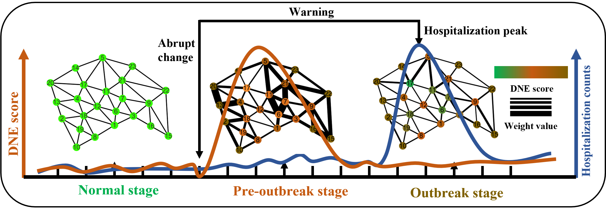

<h1 align="center">🚀Dynamic network entropy (DNE) for pinpointing the pre-outbreak stage of infectious disease</h1>

  <h2 style="font-size: 1.5em; font-weight: bold; margin-bottom: 0.5em;">
    🎉 [J. R. Soc. Interface ACCEPTED](https://doi.org/10.1098/rsif.2025.0047) 🔥
  </h2>
  

## 📖 Introduction
✨ Infectious disease outbreaks have the potential to result in substantial human casualties and financial losses. Issuing timely warnings and taking appropriate measures before infectious disease outbreaks can effectively hinder or even prevent the spread of epidemics. However, the spread of infectious diseases is a complex and dynamic process that involves both biological and social systems. Consequently, issuing accurate early warnings for infectious disease outbreaks in real-time remains a significant challenge. In this study, we have developed a **novel** computational approach called dynamic network entropy (**DNE**) by constructing **city networks** and leveraging extensive **hospital visit record data** to pinpoint early warning signals for infectious disease outbreaks. Specifically, the proposed method can accurately identify pre-outbreak of infectious diseases including influenza and hand, foot, and mouth disease (HFMD). The predicted early warning signals preceded the outbreaks or initial peaks by at least 6 weeks for influenza and 5 weeks for HFMD. Additionally, compared to other existing methods, our proposed approach exhibits good performance in pinpointing critical warning signals. Therefore, by harnessing detailed dynamic and high-dimensional information, our DNE method presents an innovative strategy for identifying the critical point or pre-outbreaks stage prior to the catastrophic transition into a pandemic outbreak, which holds significant potential for application in the field of public health surveillance.

## Recommended Readings

* **Liu, R., Zhong, J., Hong, R., Chen, E., Aihara, K., Chen, P., & Chen, L.** (2021). *Predicting local COVID-19 outbreaks and infectious disease epidemics based on landscape network entropy*. **Science Bulletin**, 66(22), 2265–2270.

  * **Journal Impact Factor (2024): approximately 9.37** 

* **Chen, L., Liu, R., Liu, Z.-P., Li, M., & Aihara, K.** (2012). *Detecting early-warning signals for sudden deterioration of complex diseases by dynamical network biomarkers*. **Scientific Reports**, 2, 342.

  * **Journal Impact Factor (2024): 3.9 (2-year), 5-year: \~4.3** 

## 🐣 Acknowledgements

We deeply appreciate the thoughtful guidance and valuable feedback from all the editors and anonymous reviewers who helped shape this manuscript. Your input truly made it better! 🌟

### 📬 Reviewer Highlights

> 💬 *"Overall, I find that the methodology presented by the authors represents a good addition to the field of mathematical epidemiology and complements other existing methods, improving our preparedness against epidemic outbreaks. The findings and the method here proposed are relevant for the physics and biology communities, thus making this contribution interesting for the Journal of Royal Society Interface readership."*

> 💬 *"In the revised version of the manuscript, the authors have satisfactorily addressed all my concerns. The new analyses included in the manuscript—breaking down the different contributions to the DNE score and comparing DNE with other benchmarks—are really helpful to understand the shortcomings and advantages of the proposed methodology."*

> 💬 *"Given the interdisciplinary interest of data-driven approaches to provide early-warning signals of the epidemic outbreak, I endorse the publication of the manuscript in Journal of the Royal Society Interface."* ✨

---

> 💬 *"This article is now clearer on the underlying framework, approach, and outputs, allowing readers to critically assess the work and its applicability, which was my main concern."*

> 💬 *"The paper continues to make some assumptions regarding the nature of spread (e.g., modeled as a continuous function with stable geographic boundaries), and I wonder whether pairing the approach with network models based on activity rather than geography (e.g., anchoring heavy nodes and counteracting them to avoid over-weighting) might be useful in future work. Best of luck with it!"* 🌈

