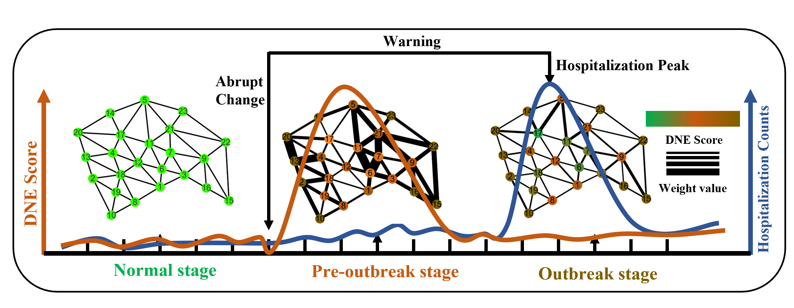

<h1 align="center">🚀Dynamic network entropy (DNE) for pinpointing the pre-outbreak stage of infectious disease</h1>

<strong>J. R. Soc. Interface accept 🔥</strong>

  

## 📖 Introduction
Infectious disease outbreaks have the potential to result in substantial human casualties and financial losses. Issuing timely warnings and taking appropriate measures before infectious disease outbreaks can effectively hinder or even prevent the spread of epidemics. However, the spread of infectious diseases is a complex and dynamic process that involves both biological and social systems. Consequently, issuing accurate early warnings for infectious disease outbreaks in real-time remains a significant challenge. In this study, we have developed a **novel** computational approach called dynamic network entropy (**DNE**) by constructing **city networks** and leveraging extensive **hospital visit record data** to pinpoint early warning signals for infectious disease outbreaks. Specifically, the proposed method can accurately identify pre-outbreak of infectious diseases including influenza and hand, foot, and mouth disease (HFMD). The predicted early warning signals preceded the outbreaks or initial peaks by at least 6 weeks for influenza and 5 weeks for HFMD. Additionally, compared to other existing methods, our proposed approach exhibits good performance in pinpointing critical warning signals. Therefore, by harnessing detailed dynamic and high-dimensional information, our DNE method presents an innovative strategy for identifying the critical point or pre-outbreaks stage prior to the catastrophic transition into a pandemic outbreak, which holds significant potential for application in the field of public health surveillance.

